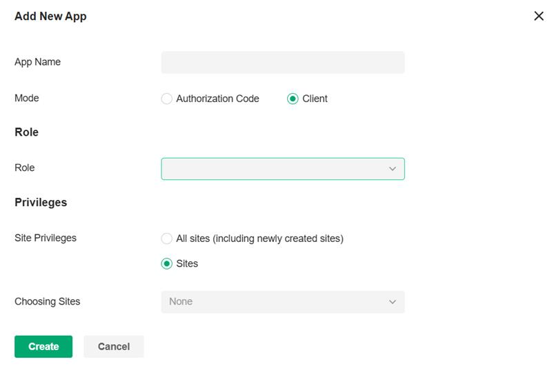

> [!IMPORTANT]
> Dernière mise à jour des scripts réalisée pour être fonctionnel sur les OC300 5.15.20.X

# Prérequis :

- Créer un dossier par client, et y mettre le contenu nécéssaire.

  - Sur l'HyperV

  ```ps1
  .
  ├── HYPERV
  │   ├── conf
  │   └── ddns_dossier_partage.ps1
  ```

  - Sur la VM :

  ```ps1
  .
  └── VM
       ├── conf
       │   ├── config.partial.json
       │   ├── config.ps1
       │   ├── ovh_ddns_config.txt
       │   └── README.md
       └── dynDNSovh.ps1
  ```

- Créer un dossier partagé sur la VM avec un utilisateur qui aura accès à ce dossier partagé.
- Domaine chez OVH
- Contrôleur Omada avec un compte admin
- Permettre les communications avec les APIs. Pour ça, aller sur le **contrôleur Omada**, dans **Settings** puis **Plateform Integration**. Ensuite cliquez sur **Add New App**, mettez le en mode **Client** et complétez avec le **bon rôle** et le **bon site** :



# Étapes :

#### 1. Sur la VM du client, copier le dossier `DDNS\VM` dans le dossier partagé.

#### 2. Sur l'HyperV, créez un nouveau dossier, à l'emplacement de votre choix et y copier `DDNS\HYPERV`.

#### 3. Modifier le fichier `VM\config\config.partial.json` avec les bons identifiants (voir ci-dessous pour savoir où trouver les identifiants).

```json
{
  "omada": {
    "base_url": "",# Sur OMADA, se trouve dans Global View -> Settings -> Plateform Intergation -> Symbole oeil
    "client_id": "",# Sur OMADA, se trouve dans Global View -> Settings -> Plateform Intergation
    "omadac_id": "",# Sur OMADA, se trouve dans Global View -> Settings -> Plateform Intergation -> Symbole oeil
    "client_secret": "",# Sur OMADA, se trouve dans Global View -> Settings -> Plateform Intergation
    "gateway_mac": ""# Sur OMADA, l'adresse MAC du routeur, se trouve dans Global View -> Devices
  },
  "vpn": {
    "definitions": [
      {
        "domaine": "",# Se trouve dans OVH
        "vpn_name": ""# Sur OMADA, se trouve dans $NOMDUSITE -> Settings -> VPN
      }
    ]
  }
}
```

#### 4. Exécuter le script `DDNS/VM/conf/config.ps1` sur la VM, puis mettre le fichier qui vient d'être créé : `config.json`, sur l'HyperV dans `HYPERV/conf`.

Pensez à supprimer `config.partial.json` et `config.ps1` de votre `/DDNS/VM` après l'exécution.

#### 5. Vérifier les informations du fichier `VM/conf/config.json` (voir ci-dessous).

> [!WARNING]
> Afin que les WAN ne sois pas changés aléatoirement, il faut mettre un ordre de priorité. Cela se fait grâce à `"priority": 1-2-3-etc,` avec 1 étant le wan le plus prioritaire.

Exemple du fichier `config.json` :

```python
{
    "vpn":  {
        "definitions":  [
            {
                "port":  , # Se met tout seul
                "vpn_id":  "", # Se met tout seul
                "vpn_name":  "", # Se met tout seul
                "wans":  [
                    {
                        "priority":  1, # À l'utilisateur de le renseigner
                        "ip":  "", # Se met tout seul
                        "name":  "", # Se met tout seul
                        "id":  "" # Se met tout seul
                        },
                    {
	                    "priority":  3, # À l'utilisateur de le renseigner
                        "ip":  "", # Se met tout seul
                        "name":  "", # Se met tout seul
                        "id":  "" # Se met tout seul
                        },
                   {
	                    "priority":  2, # À l'utilisateur de le renseigner
                        "ip":  "", # Se met tout seul
                        "name":  "", # Se met tout seul
                        "id":  "" # Se met tout seul
                    }
                ],
	        "domaine":  "", # Se met tout seul
            "ip_pool":  {
                            "mask": , # Se met tout seul
                            "ip":  "" # Se met tout seul
                        }
            }
        ]
    },
    "omada":  {
                  "base_url":  "", # Se met tout seul
                  "client_id":  "", # Se met tout seul
                  "omadac_id":  "", # Se met tout seul
                  "client_secret":  "", # Se met tout seul
                  "gateway_mac":  "" # Se met tout seul
              }
}
```

> [!IMPORTANT]
> Pour les mots de passe à mettre dans le fichier `VM/config/ovh_ddns_config.txt`, attention à ne pas mettre le caractère **:** car c'est le séparateur de champs.

#### 6. Mettre les identifiants OVH dans `DDNS/VM/conf/ovh_ddns_config.txt` puis exécuter le script `VM/dynDNSovh.ps1` sur la VM (en faire une tâche planifiée).

Ce scirpt permettra de mettre à jour votre enregistrement DynDNS sur OVH automatiquement lorsque l'IP publique va changer.

#### 7. Indiquer le chemin vers le fichier `ip_state.json` se trouvant dans le dossier partagé sur la VM, dans le script `ddns_dossier_partage.ps1`.

> [!IMPORTANT]
> Attention à ne pas mettre de " (guillemets) dans le nom du fichier partagé.

```ps1
$ipStateDir = "\\IP_SERVER\Shared\VM"
$utilisateur = "IP_SERVER\USER_SHARED"
$motDePasse = "PASSWORD_USER_SHARED"
```

#### 8. Exécuter le script `ddns_dossier_partage.ps1` (en faire une tâche planifiée).

Ce scirpt va permettre la mise à jour des WANs sur OMADA automatiquement. Le changement d'IP détecté par `dynDNSovh.ps1`, va mettre à jour l'IP contenu dans le fichier `ip_state.json` et la comparer avec celle contenu dans `ip_state_old.json`. Lorsque l'ip est différente, il va la comparer avec les IPs contenu dans le fichier `config.json` et mettre à jour le WAN.
